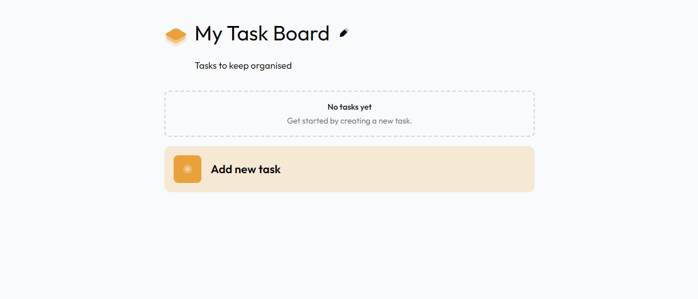

This is a [Next.js](https://nextjs.org/) project bootstrapped with [`create-next-app`](https://github.com/vercel/next.js/tree/canary/packages/create-next-app).

# Taskboard

Taskboard is a small website I built, where you can manage your tasks easily. You can make new tasks, change them, or remove them when you don't need them anymore.

## Features

- **Manage Tasks**: You can create, edit, and delete your tasks as needed.
- **Share with Others**: If you want someone else to see your Taskboard, you can share it by sending them a URL.
- **Works on Any Device**: Taskboard looks great whether you're using a phone, tablet, or computer.
- **Technology**: This project is built using Next.js version 14 and React version 18.

## Getting Started

To start using Taskboard, just open this URL: https://task-board-kappa.vercel.app/

## Feedback

This Taskboard is part of a [challenge from devchallenges.io](https://devchallenges.io/challenge/my-task-board-app). If you have any feedback or suggestions, feel free to let me know!
